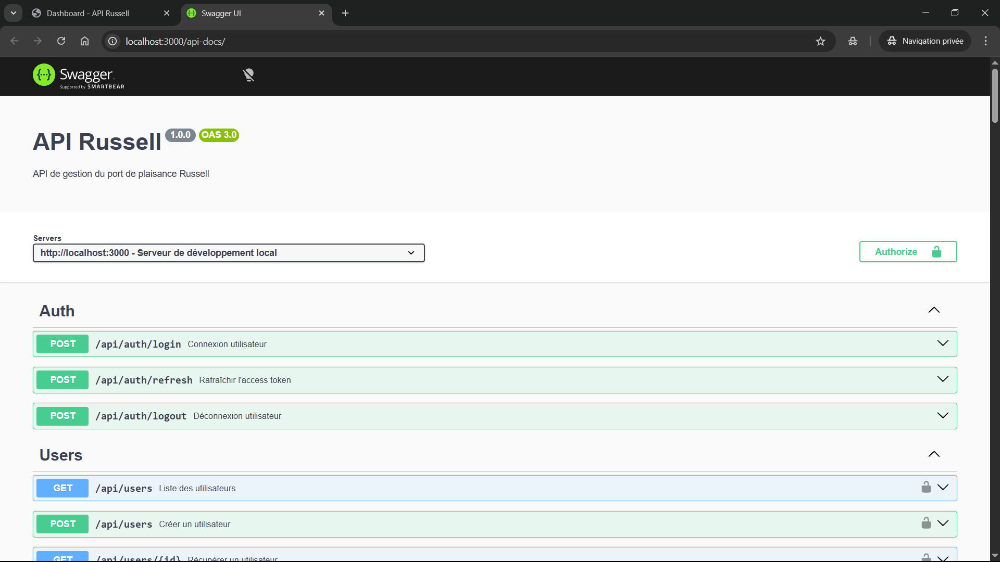
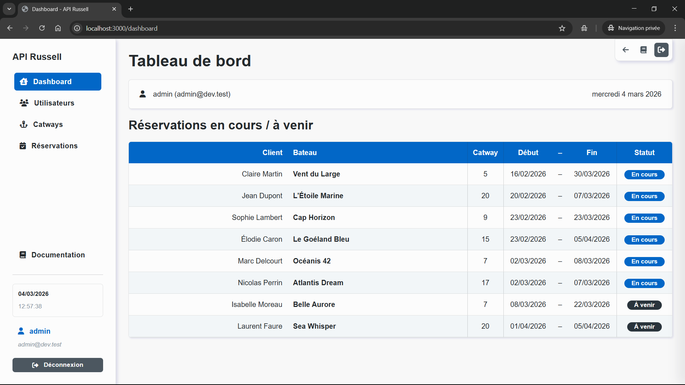
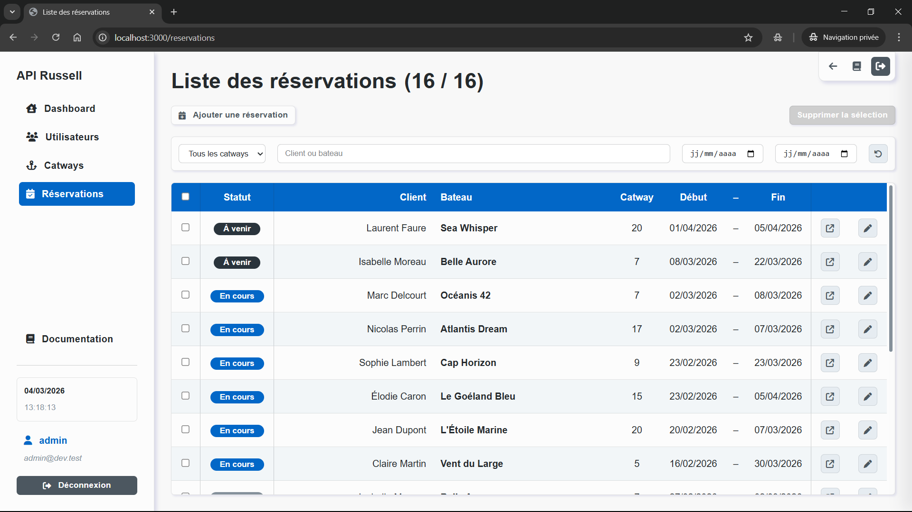

# API Russell


API de gestion d’un port de plaisance développée dans le cadre du **Devoir 6 – Formation Développeur Web & Web Mobile (CEF)**.

Cette application permet de gérer :

- les **utilisateurs**
- les **catways** (places d’amarrage)
- les **réservations**

L’application est composée de deux parties :

- **API REST sécurisée** (Node.js / Express / MongoDB)
- **Interface Web interne** permettant d’administrer les données

La documentation de l’API est fournie via **Swagger (OpenAPI 3)**.

---

## Table des matières

- [Fonctionnalités principales](#fonctionnalités-principales)
- [Sécurité / Authentification](#sécurité-et-authentification)
- [Documentation API](#documentation-api)
- [Architecture du projet](#architecture-du-projet)
- [Captures d’écran](#captures-décran)
- [Installation du projet](#installation-du-projet)
- [Variables d’environnement](#variables-denvironnement)
- [Lancer le projet](#lancer-le-projet)
- [Base de données](#base-de-données)
- [Tests API](#tests-api)
- [Déploiement](#déploiement)
- [Technologies utilisées](#technologies-utilisées)
- [Auteur](#auteur)

---

## Fonctionnalités principales

### Authentification

- Connexion via **JWT**
- Access Token
- Refresh Token
- Middleware de protection des routes

Endpoints :

```
POST /api/auth/login
POST /api/auth/refresh
POST /api/auth/logout
```

---

### Gestion des utilisateurs

- Consultation
- Création
- Modification
- Suppression
- Mise à jour du mot de passe

Endpoints :

```
GET /api/users
GET /api/users/:id
POST /api/users
PUT /api/users/:id
PUT /api/users/:id/password
DELETE /api/users/:id
```

---

### Gestion des catways

Les catways représentent les emplacements d’amarrage du port.

Fonctionnalités :

- consultation
- création
- modification
- suppression
- récupération du prochain numéro disponible
- vérification de disponibilité
- vérification des suppressions en masse sensibles
- suppression multiple

Endpoints principaux :

```
GET /api/catways
GET /api/catways/:id
GET /api/catways/next-number
GET /api/catways/check-number
POST /api/catways
POST /api/catways/bulk-check
PUT /api/catways/:id
DELETE /api/catways/:id
DELETE /api/catways/bulk
```

---

### Gestion des réservations

Les réservations sont liées à un catway.

Fonctionnalités :

- consultation
- création
- modification
- suppression
- recherche de disponibilité
- vérification des suppressions en masse sensibles
- suppression multiple

Routes principales :

```
GET /api/reservations
POST /api/reservations/availability
POST /api/reservations/bulk-check
DELETE /api/reservations/bulk
```

Routes imbriquées :

```
GET /api/catways/:id/reservations
GET /api/catways/:id/reservations/:idReservation
POST /api/catways/:id/reservations
PUT /api/catways/:id/reservations/:idReservation
DELETE /api/catways/:id/reservations/:idReservation
```

---

## Sécurité et authentification

L'API utilise un système d'authentification basé sur **JSON Web Tokens (JWT)**.

Le processus d'authentification fonctionne en deux étapes :

1. L'utilisateur s'authentifie via :
    ```
    POST /api/auth/login
    ```
    Le serveur génère alors :
    - un **Access Token**
    - un **Refresh Token**

2. L'**Access Token** doit être envoyé dans les requêtes protégées via le header :
`Authorization: Bearer`

    Si l'accès Token expire, un nouveau token peut être obtenu via :
    ```
    POST /api/auth/refresh
    ```

Les routes sensibles de l'API sont protégées par un **middleware d'authentification** qui vérifie la validité du token.

---

## Documentation API

La documentation complète est disponible via **Swagger**.

### Accès à la documentation

En développement (local) :

http://localhost:3000/api-docs

En production :

https://kernec-cedric-devoir-6-api-russell.onrender.com/api-docs

La documentation est basée sur **OpenAPI 3** et structurée dans :

```
src/docs/
```

Elle inclut :

- les **schémas de données**
- des **exemples de requêtes et réponses**
- les **réponses d'erreur**
- la **définition complète des endpoints**

---

## Architecture du projet

Le projet suit une architecture **modulaire** séparant clairement :

- API
- logique métier
- interface web
- documentation

Structure simplifiée :

```
docs
 └── images
postman
public
 ├── css
 ├── images
 └── js
src
 ├── api
 │   ├── config
 │   ├── controllers
 │   ├── data
 │   ├── middlewares
 │   ├── models
 │   ├── repositories
 │   ├── routes
 │   ├── services
 │   ├── utils
 │   ├── validators
 │   └── seed.js
 │
 ├── docs
 │   ├── components
 │   ├── paths
 │   └── openapi.yaml
 │
 ├── web
 │   ├── configs
 │   ├── controllers
 │   ├── gateways
 │   ├── middlewares
 │   ├── routes
 │   ├── utils
 │   └── views
 │
 └── server.js
```

---

## Captures d’écran

### Documentation API (Swagger)



### Interface d’administration



### Gestion des réservations



---

## Installation du projet

### 1. Cloner le projet

```
git clone https://github.com/cedrickernec/kernec-cedric-devoir-6-api-russell.git
```

### 2. Installer les dépendances

```
npm install
```

---

## Variables d’environnement

Créer un fichier `.env` :

```
MONGO_URI=
JWT_SECRET=
JWT_REFRESH_SECRET=
ACCESS_TOKEN_DURATION=
REFRESH_TOKEN_DURATION=
SESSION_SECRET=
NODE_ENV=
```

Ces variables sont nécessaires au fonctionnement de l’authentification et de la base de données.

---

## Lancer le projet

Mode développement :

```
npm run dev
```

Mode production :

```
npm start
```

---

## Base de données

Le projet utilise **MongoDB**.

Les modèles principaux :

- User
- Catway
- Reservation

Un script de seed est disponible :

```
src/api/seed.js
```

---

## Tests API

Une collection **Postman** est fournie dans le projet :

```
/postman
```

Elle contient :

- la **collection complète de l'API**
- un environnement **DEV**
- un environnement **PROD**

Ces fichiers permettent de tester facilement toutes les routes de l’API.

### Importation dans Postman

1. Ouvrir **Postman**.
2. Importer la collection et les environnements situés dans :
```
postman/API-Russell.postman_collection.json
postman/API-Russell-DEV.postman_environment.json
postman/API-Russell-PROD.postman_environment.json
```

### Configuration des variables d'environnement

Dans les environnements Postman, les variables suivantes doivent être renseignées :

`loginEmail`
`loginPassword`

Ces identifiants sont utilisés pour la requête d'authentification :

```
POST /api/auth/login
```

Une fois authentifié, les tokens générés sont automatiquement utilisés par les autres requêtes protégées de la collection.

### Utilisation

1. Sélectionner l'environnement **DEV** ou **PROD**
2. Exécuter la requête :
```
POST /api/auth/login
```
3. Les tokens générés seront automatiquement enregistrés dans l'environnement et utilisés pour les requêtes suivantes.

---

## Déploiement

Le projet est déployé sur **Render**.

Le service est configuré avec :

```
Build Command : npm install
Start Command : npm start
```

Les variables d’environnement sont configurées directement dans Render.

API accessible :

https://kernec-cedric-devoir-6-api-russell.onrender.com

Documentation Swagger :

https://kernec-cedric-devoir-6-api-russell.onrender.com/api-docs

---

## Technologies utilisées

Backend :

- Node.js
- Express
- MongoDB
- Mongoose
- JWT
- bcrypt

Documentation :

- OpenAPI 3
- Swagger UI

Frontend interne :

- EJS
- JavaScript
- CSS

Outils :

- ESLint
- Postman
- Render

---

## Auteur

Projet réalisé dans le cadre de la formation **Développeur Web & Web Mobile (CEF)**.

Auteur : **Cédric Kernec** | **PixSeed**
